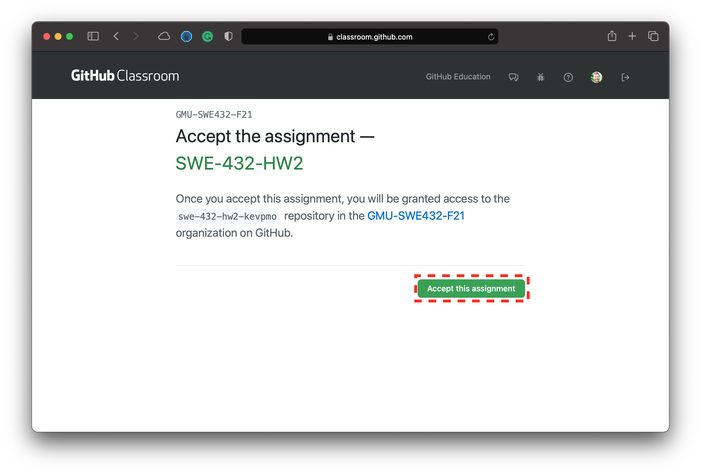
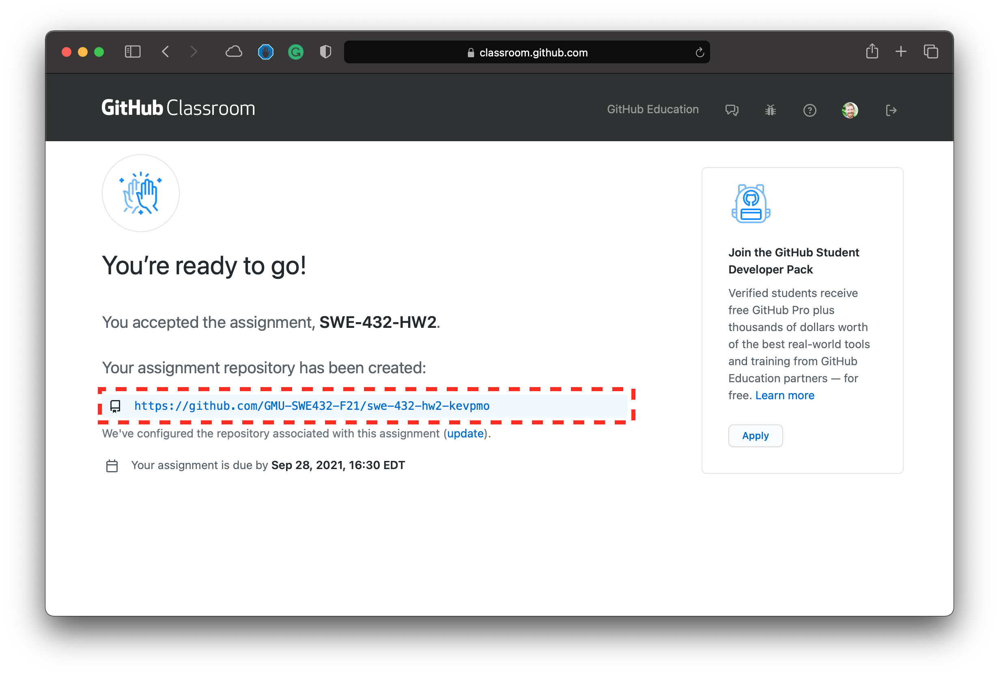
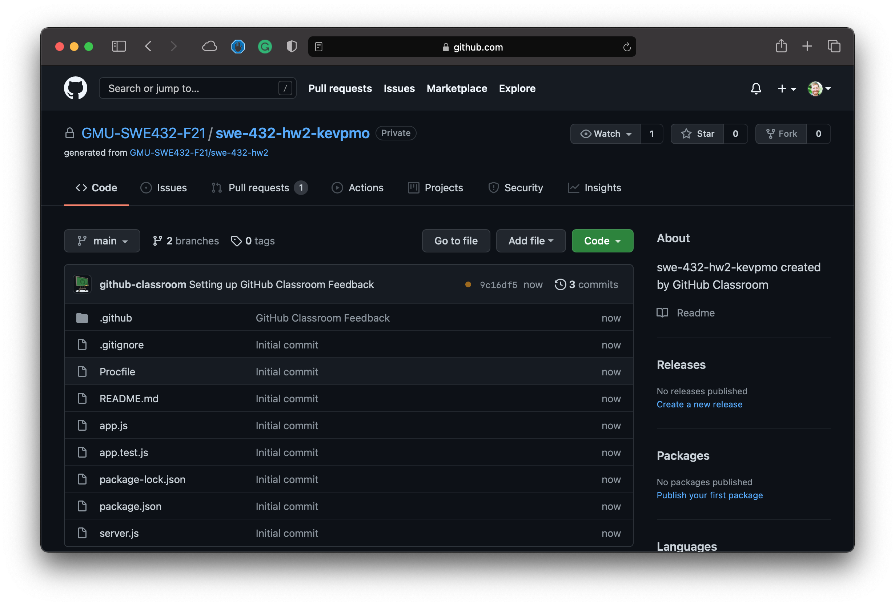
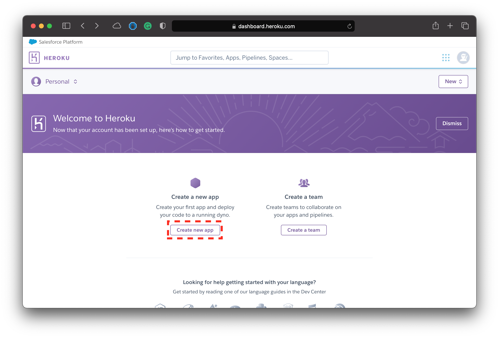
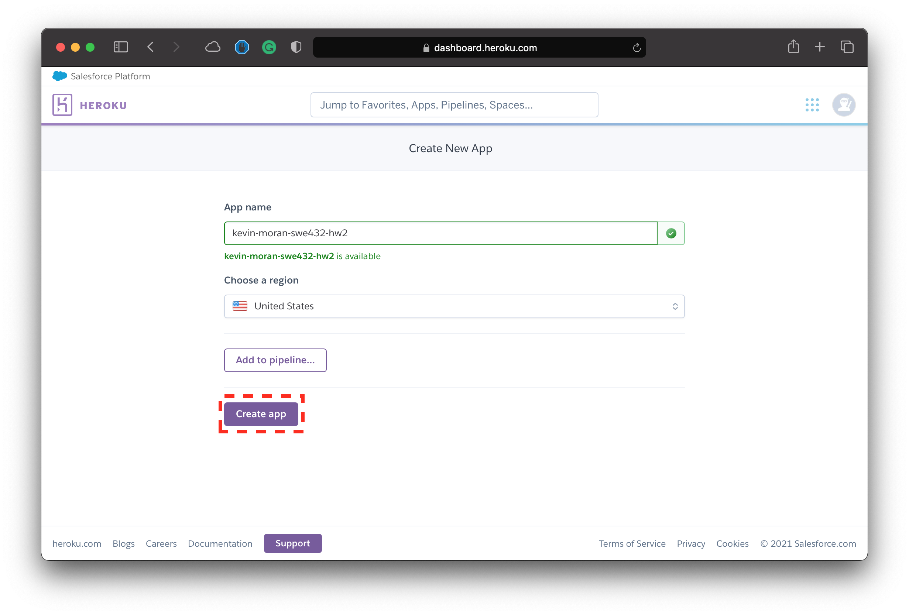
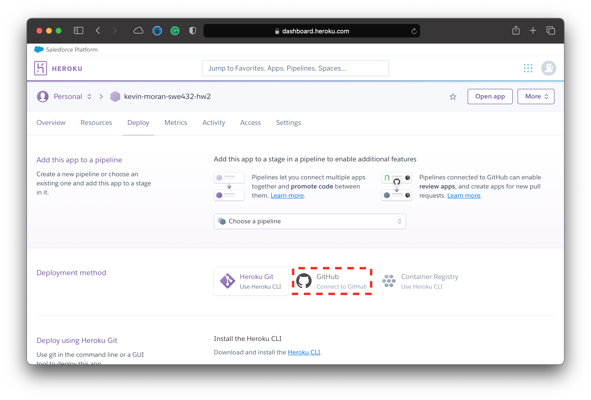
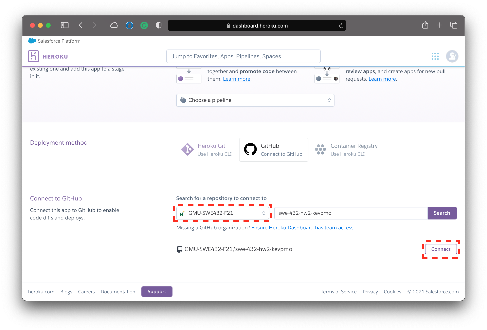
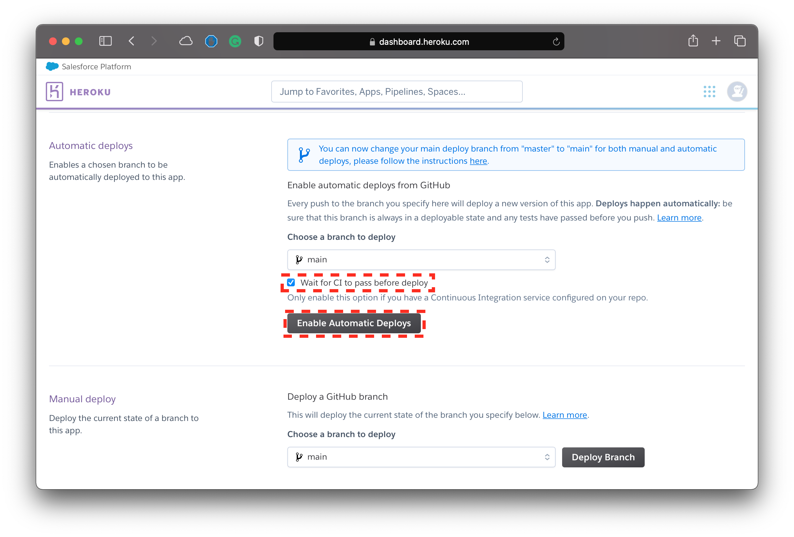
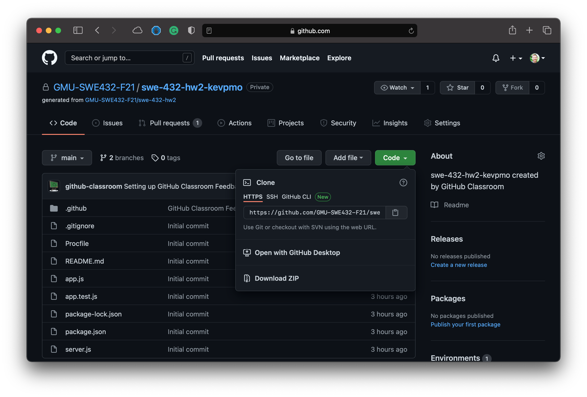

## 0) Overview

This tutorial explains how to deploy and develop a Heroku app through GitHub that can run a `node.js` microservice. The tutorial covers creating GitHub and Heroku accounts, deploying your app via Heroku, and developing your web app locally. To work through this tutorial, you will need to be connected to the internet, you will need to be comfortable issuing commands through a command-line terminal interface, be comfortable with the `git` version control system, and you will need to know how to program in `javascript` and `node.js`.

## 1) Prelude

To develop web apps, it is important to mentally separate development from deployment. Development includes design, programming, testing, and debugging. Development is usually done locally on the developer’s computer. Deploying is the process of publishing a web app to a server so users can access it, including compiling, installing executables in appropriate folders (or directories in Unix-speak), checking connections to resources such as databases, and creating the URLs that clients will use to run the web app. In a large project, these issues can get quite complex and professional deployers take care of it. Our deployment process is small, simple, and student accessible. Heroku is a free hosting service for web apps than can be linked with GitHub to auto-deploy. Heroku also offers development tools so you can test and debug your app locally. This tutorial focuses on a `node.js` web application, but Heroku supports several other web software technologies.

We will be using GitHub Classroom to help manage the GitHub repositories for this assignment, and we also cover the basics of using it in this tutorial.

Please take a moment to explore each concept, technology, command, activity, and action used in this tutorial. We try to strike a balance between brevity and completeness, and welcome feedback and suggestions. (Feel free to make an Ed post if you have questions!)

Additionally, check out [Dr. Moran's Week 4 lecture video](../week-4-lecture-video.md), where he covered many of the basics of getting started with Homework 2 using `node.js` and `Express`.

## 2) Create GitHub and Heroku Accounts

The first thing that you need to do is create **free** accounts for both [GitHub](https://github.com/) and [Heroku](https://heroku.com/). 

*  You can sign up for a free GitHub account account using [this link](https://github.com/).
*  You can sign up for a free Heroku account account using [this link](https://signup.heroku.com/).

## 3) Joining the Assignment in GitHub Classroom

### 3.1) Accepting the Assignment

In order help organize the repos for the second homework assignment, we will be making use of [GitHub Classroom](https://classroom.github.com/). By "accepting" the assignment in GitHub Classroom, the service will automatically create a copy of the repository with the starter code that we covered in class. This will help get you up and running for this assignment. To "accept" the assignment, please click on the button below. (Note that you will be prompted to sign in to your GitHub account if you haven't already)

<style type="text/css">
.center {
  display: block;
  margin-left: auto;
  margin-right: auto;
}
</style>

<div style="text-align: center;">
<a href="https://replit.com/teams/join/ytycoiasnoodvirnvtbxqrspmqzwbsxf-SWE-432-F21" title="Click Here to Accept the Assignment on GitHub Classroom" class="md-button md-button--primary">Click Here to Accept the Assignment on GitHub Classroom</a>
</div>

After you click on the link above you will be presented with the screen below. Simply click "Accept" to continue.



You will then see a message that the service is working to create your assignment. After a few seconds, you can refresh the page and you should see a page similar to the following:



You can then click on the link to view your newly created repository. This repository should look like the example you see below.



!!! note
    It is important to note that you should **only** work out of this repository for this assignment. We will grade the last commit made before the deadline (see the [hw2 assignment page](../hw2) for more details). If you make a commit *after* the deadline, we will grade that instead and your assignment will be considered late.
    
!!! warning
    Note that the repo that is created is **not** associated with your GitHub username. Instead, it is associated with the GMU-SWE432-F21 GitHub Organization and your GitHub user is granted access. Therefore, it may not show up in the usual places where you find your personal repos in GitHub. Once you are added to the organization (see next instructions) it will be easy to access (You can do this by access the [organizations page](https://github.com/settings/organizations) of your account). However, we also encourage you to bookmark link to the repository generated by GitHub Classroom.

### 3.2) Joining the Class Organization

In order to properly deploy your application to Heroku, the instructors will need to add you to the GMU-SWE432-F21 GitHub Organization. This can only be done **after** you accept the assignment via the button above. By adding you to the organization, this will grant you the privilege to deploy the app from the organization in Heroku.

We ask that all students "accept" the assignment in GitHub classroom by Monday, September 20th. However, we will add students as they register to the best of our ability.

You can confirm that you were successfully added to the organization by seeing if your name appears in the member list [here](https://github.com/orgs/GMU-SWE432-F21/people).

!!! note
    In order to join the organization and deploy your app through Heroku, you must accept the invitation sent to you by the instructors. You will receive an email invitation asking you to join the organization, and you should also see the invitation in GitHub if you visit the [organization page](https://github.com/GMU-SWE432-F21).

!!! note
    If you are waiting on gaining access to the GMU-SWE432-F21 GitHub organization, you can skip ahead to Section 5 of this tutorial and come back to set up your Heroku deployment later.

### 3.3) Understanding Continuous Integration with GitHub Actions

Currently, the starter repo is configured to run your Jest tests each time you push your code to the repository (See Section 5 for more information about how to push changes to your repo). This form of automated testing is a type of [continuous integration (CI)](). Continuous integration is essentially the practice of automating the integration of code changes from contributors to a software project, and is generally considered to be a DevOps best practice. 

Here we are using a simple form of CI, as your automated Jest tests will run each time you modify code and update your Github repo with the changes. As we will see in the next section ,we will configure Heroku to **only** deploy the application if your automated tests pass. We are enabling the automated tests using [GitHub Actions](https://github.com/features/actions). WE will touch on this more later in this tutorial.

## 4) Deploying your Web App via Heroku

Now that you have been granted access to the HW Assignment #2 starter repo through GitHub Classroom **and** you have been accepted into the GMU-SWE432-F21 GitHub Organization you are ready to deploy the starter web application using Heroku.

Your Heroku app contains all the javascript files that you will deploy for your microservice. The name you choose becomes part of the URL address to your web apps. For instance, you can access an example web-app at [https://kevin-moran-swe432-hw2.herokuapp.com](https://kevin-moran-swe432-hw2.herokuapp.com) for the example illustrated in this section.

First you should sign into your Heroku account and navigate to the dashboard landing page illustrated below.



Then you should click on the "Create New App" button highlighted in red. This will bring you to the screen displayed below.



Next, you should create a name for your application. We would like you to adhere to the following naming convention when creating your app: `<firstname-lastname>-swe432-hw2`. For example if Dr. Moran were creating his Heroku app, he would use `kevin-moran-swe432-hw2`, as shown in the example url at the beginning of this section. After this you should click on the "Create App" button. Doing that should bring you to the screen shown below.



Next you will need to connect your GitHub account to Heroku. To do this, click on the GitHub button highlighted in the image above. You will then be prompted to authenticate your GitHub account and acknowledge that you are giving the Heroku service access. After that you should see the repository selection interface shown in the screen below. 



Here you will need to select the repo that GitHub Classroom created for you. Therefore, you will need to select the class organization from the dropdown menu and then use the interface to search for your repository. After you select the proper repository, click on the "Connect" button to see the deployment interface as shown in the next screenshot.

!!! warning
    It is important to note that you will **not** be able to deploy your application until you have accepted the invitation to join the GMU-SWE432-F21 GitHub Organization.
    

    
After confirming your repository, you will then need to set up Heroku to deploy your application when you push to the `main` branch of your repository. To do this, you should "check" the option that will wait until your CI passes before deployment (this ensures you only deploy code that passes all of your tests). And then you should click on the "Enable Automatic Deployment" button. This means that each time you push to the `main` branch of your repository, and all of your automated tests pass, then your application will get deployed.

Finally, you can click on the "Deploy Branch" button to deploy the current version of your application.

### 4) Compile and Build Errors

Heroku compiles your code when you push it. If the compile fails, you can see the errors through the [Heroku dashboard](https://dashboard.heroku.com/apps). Click the "Activity" tab, and look for a red message reading “Build failed.” Note that if your automated tests fail in GitHub, then your application will not be deployed. When you are ready to work through step 5 of this tutorial, you can learn how to develop and compile locally, which is quicker and easier.

## 5) Setting Up and Using your Local Development Environment

Now that you have a GitHub repository to work from, and your web app will automatically deploy using Heroku, you need to set up an environment where you can develop and test your microservice "locally" on your own machine. This section of the guide will walk you through the different steps and commands necessary to do so.

!!! note
    This section of the tutorial assumes some familiarity with Git. If you are newer to using the Git version control system, I would encourage you to check out [this guide](https://git-scm.com/docs/gittutorial). 

### 5.1) Downloading and Installing Node.js and Git

Before we can get started with setting up your local development environment, you will need to install Node.js on your machine. 

Please visit the [node.js download page](https://nodejs.org/en/download/) in order to download the version that is appropriate for your machine and operating system.

Install Git on your local machine from [Git’s download site](https://git-scm.com/downloads) if you do not already have it installed. This will let you use the `git` command.  For Windows, the Git download above adds bash if you do not already have it and has its own command window. If you already use `cygwin`, Git will add its command folder to your PATH environment variable. You can also use Windows Subsystem for Linux as mentioned earlier on in this guide.

### 5.2) Cloning Your repository

The first thing that you will need to do is clone the repository that GitHub Classroom created for you. To do this, navigate to your repo page and click on the "Clone" button, and then copy the url that is displayed by clicking on the clipboard icon as shown in the image below.



Next you will need to clone the repo from the command line. To do this, you can execute the following command. **Note that you only need to run this command once.**
    
``` bash linenums="1"
git clone https://github.com/GMU-SWE432-F21/<your_repo_name>
```

!!! tip
    Make sure you navigate to the local directory where you would like your repository to be located.
    
!!! note
    Note that GitHub recently changed how it handles authentication. As such, you may need to set up an `ssh key`, use a personal access token, or authenticate using OAuth. Check out [this article](https://docs.github.com/en/github/authenticating-to-github/keeping-your-account-and-data-secure/about-authentication-to-github#authenticating-with-the-command-line) for you can set up command line access. Feel free to post any questions to Ed.
    
### 5.4) Deploying your Microservice Locally

Now that you have cloned the repository by downloading it to your machine, you can deploy it locally to quickly check changes using an application such as Postman without having to push your code to GiHub and deploy to Heroku.

To deploy your application locally, you can use the following commands:

``` bash linenums="1"
cd <your-repo-name> # This will move you into the proper directory
npm install # This will install all the neccesary packages
npm start # This will start the express server and listen on port 3000
```

This will deploy a running version of your microservice at [http://localhost:3000](http://localhost:3000).

### 5.5) Editing Code

Now that you know how to run your code locally, you can start to work on your project by editing your code!

To do this, you can use your Text Editor or IDE of choice. Some potential options include [vim](), [Sublime Text](), [Atom](), and [VSCode]() among many other options. Feel free to use whatever editor you feel most comfortable with for this homework assignment.

### 5.6) Using Postman to Debug and Test your API Endpoints

Throughout the development process, you may wish to test or debug the behavior of your API endpoints. To do this, you can use the [Postman]() app to send various types of requests. 

First download Postman here.

Then, once the application is installed, you can create a new entry and send requests using the interface as seen below.


### 5.7) Running your Jest Tests Locally

While the tests that you write will be automatically executed each time you commit your code to your repo, you can also run these tests locally to get an idea of their behavior before you commit and push your changes to the remote GitHub repository. 

To run your tests locally, you can run the following command within the directory of your project:

``` bash linenums="1"
npm test # This will run all of the jest tests in the app.test.js file
```

You will then see the output of the tests and whether or not they passed successfully.

### 5.7) Pushing your Local Changes to the Remote Repo

Reuse the following commands every time you need to send your changes to GitHub, in a terminal command-line window. Run these commands from your same project folder.

``` bash linenums="1"
git add .
git commit -m "message explaining this commit" # A good first-time message might be: "Initial commit: first changes"
git push
```

The text in quotes should explain what this current commit is doing and should be clear and explicit to avoid creating maintenance debt. The idea is to document why you made the changes so that everyone who wants to contribute to your project understand, including **you** after a month not looking at the file.

!!! note
    You may asked to authenticate with GitHub the first time you push. If you push again without changing anything, you will get the message “Everything up-to-date.” That's a good way to check if your repo is synchronized with your computer.

### 5.7) Examining Jest CI Test Results in GitHub Actions

The starter GitHub repo is set up to run the Jest tests in the `app.test.js` file upon each commit to the main branch of the repository. If any of the tests fail, the CI process will fail and this will be indicated with red "X" on the main page of your repo, and GitHub will likely also send you a notification email that your automated tests have failed. You can view the errors by clicking on the red "X" and checking the test logs.

Currently, the tests are configured to run via GitHub Actions by getting deployed to a remote virtual server with an Ubuntu operating system, where the `npm install` and `npm test` commands are executed. We don't anticipate you needing to change this configuration, as it is fine to keep all of your tests in the `app.test.js` for this assignment.

We expect that all of your (at least) 12 unit tests will have passed via CI by the time you turn in the assignment. That is, when you make your final commit (see Section 6) we expect all tests to be passing in GitHub.


## 6) Submitting Your Assignment

### 6.1) Updating your Project README

In order for your assignment to be considered for grading, you must be sure that you fill out the following information at the top of your README file and ensure that this is up to date in your GitHub repo.

*  **Student Name**
*  **Student G-number**
*  **Heroku Deployment URL**

!!! warning
    Failure to include this information in your submission is likely to result in a zero for the assignment!
    
### 6.2) Submission Protocol

There is no formal submission process for this assignment. We will simply grade the last commit to the `main` branch of your repository before the deadline of 4:30pm on Wednesday, September 28th. If you make a commit after the deadline, we will grade the latest commit and your assignment will be considered late. Per our course policy, assignments submitted over 48 late will not be accepted.
