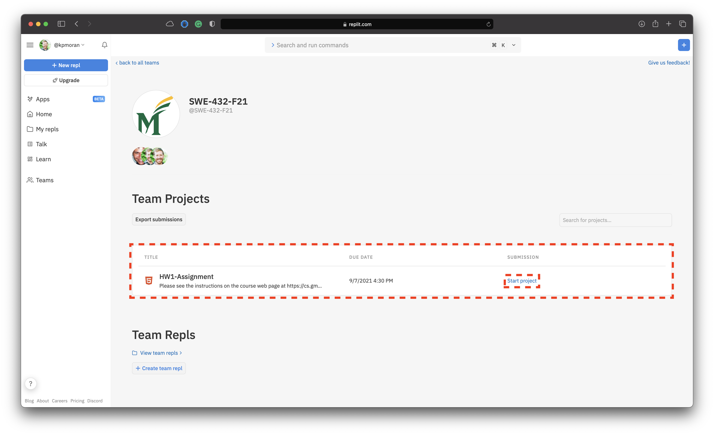
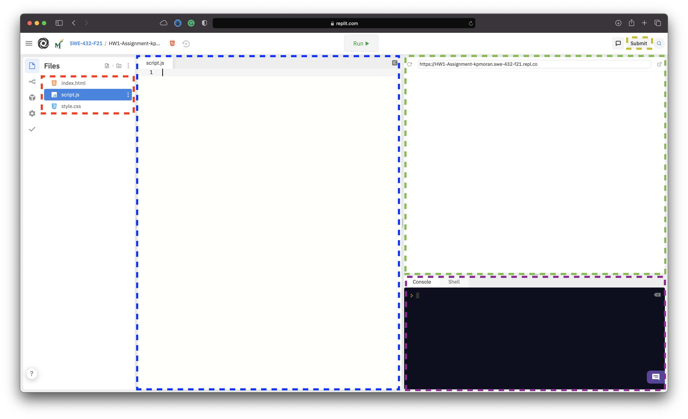

## Using replit for Assignments

This semester, we will be using [replit](https://replit.com/) for certain homework assignments. Replit is a cloud-based IDE that allows for programming with a range of different web technologies. This will allow us to facilitate answering questions and providing detailed feedback on your assignments. Please follow the steps below to sign up for a replit account and access assignments.

### Signing up for a replit account

The first thing that you need to do before you can access replit, is to sign up for a free account **using your gmu email address**. This will allow you to join our class. 

You can sign up for a free replit account using [this link]().

### Joining the SWE-432 Course Team

In replit, our course is organized as a "team", and you will need to join this team in order to access the class assignments. you can join the SWE-432 replit team using the button below:

<a href="https://replit.com/teams/join/ytycoiasnoodvirnvtbxqrspmqzwbsxf-SWE-432-F21" title="Click Here to Sign up for SWE-432 on Replit" class="md-button md-button--primary"> Click Here to Sign Up for SWE-432 on Replit</a>

### Accessing Individual HW Assignments

HW assignments that are to be completed through replit will have a link to the assignment at the bottom of the assignment page. Once you have signed up for an account, and joined the class via the link above, you can click on the button to join the assignment from the respective assignment page. For the sake of demonstration, let's work through adding the initial assignment for HW1 below.

<a href="https://replit.com/team/SWE-432-F21/HW1-Assignment" title="Click Here to Access HW Assignment 1 in replit" class="md-button md-button--primary"> Click Here to Access HW Assignment 1 via Replit </a>

1. First click on the assignment link above and open it in a new window, this will prompt you to log in if you haven't already done so.

2. Once you log in, you will be presented with the screen shown below. Here you can see the HW assignment, and the button to start working on the homework assignment, called the "Start Project" button. Click on the "Start Project" button to move on.

3. Once you have clicked on the start project button, this will bring up the In-browser IDE for the HW assignment. The configuration of the IDE will be set up Dr. Moran & David specifically for each assignment. For example, for the first homework assignment, you will only be required to work in the `script.js` file. 

There are several important features that you should be aware of in the replit IDE that are highlighted below:

* **File explorer** (highlighted in red) - this will allow you to navigate between the various files for the HW assignment 
* **File Editor** (highlighted in blue) - this is where you can edit your code and other text files for the assignment
* **Web Browser Window** (highlighted in green) - this will allow you to see the html result of your code (if required for a HW)
* **Console/Shell** (highlighted in purple) - this will allow you to see the shell output for your program 
* **Submit button** (highlighted in yellow) - after you have completed your project, you use this button to submit your work. You can submit your work multiple times before the deadline.

Once you have finished working on and testing your code, you can submit the assignment for review using the "Submit" button as indicated above. You can submit your code multiple times (e.g., you can submit, and then continue to edit your code and submit again). 